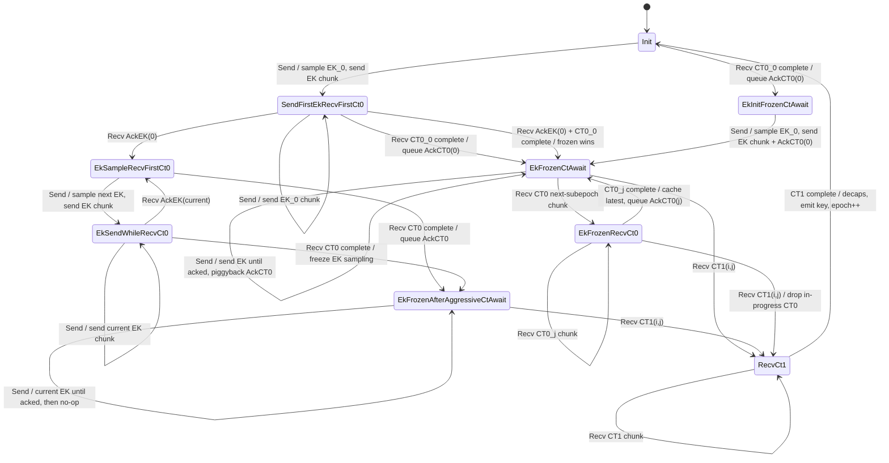
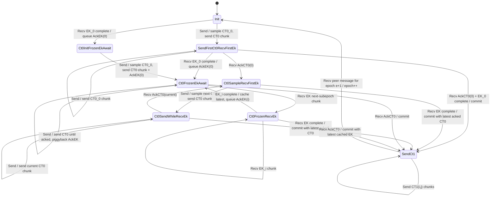

# Agg-UniKEM Parallel Role Model Draft

Names are provisional; the goal is to settle the logic before choosing
implementation names. The C++ simulator currently uses the role-level state
names in this draft.

All roles ignore messages for old epochs. Alice starts epoch 1 in the EK-sender
role and Bob starts in the CT-sender role. After an epoch completes, the
decapsulating EK side advances to the next epoch as the CT sender, and the CT
side advances to the next epoch as the EK sender once it observes a peer message
for that next epoch.

## EK-Sender Role

The EK-sender role sends EK subepochs and receives CT0/CT1 subepochs.

Local state includes:

* current message epoch `e`;
* at most one active EK encoder and its DK;
* at most one acknowledged/frozen DK that may be used for CT1;
* a CT0 decoder or cached latest complete CT0;
* a pending CT0 ack;
* a CT1 decoder once CT1 starts.

### `Init`

No EK has been sampled for epoch `e`; no CT0 has been completed.

| Event | Transition | Output / notes |
|---|---|---|
| Send | sample `(EK_0, DK_0)`, encode `EK_0`, go to `SendFirstEkRecvFirstCt0` | send EK chunk |
| Recv CT0 chunk | add to first CT0 decoder; if complete, go to `EkInitFrozenCtAwait` | queue CT0 ack |
| Recv other | no-op | old/stale/impossible |

### `SendFirstEkRecvFirstCt0`

The first EK is being sent; the first CT0 is being received; no EK ack has been
processed.

| Event | Transition | Output / notes |
|---|---|---|
| Send | stay | send next `EK_0` chunk, piggyback CT0 ack if pending |
| Recv CT0 chunk | add to first CT0 decoder; if complete, go to `EkFrozenCtAwait` | queue CT0 ack |
| Recv EK ack for `EK_0` | go to `EkSampleRecvFirstCt0` | keep `DK_0` as acknowledged DK |
| Recv EK ack plus CT0 chunk | process atomically; if CT0 completes, go to `EkFrozenCtAwait` | frozen path wins |

Race note: if one incoming message both acknowledges `EK_0` and completes
`CT0_0`, the role chooses the frozen path, not the aggressive EK-sampling path.
The peer is ready to commit once it receives/has the acknowledged CT0.

### `EkInitFrozenCtAwait`

The first CT0 was received before this side had sent any EK for the epoch. The
role is "frozen" only in the sense that it must send the first EK and then wait
for CT1; it should not enter an aggressive EK loop.

| Event | Transition | Output / notes |
|---|---|---|
| Send | sample `(EK_0, DK_0)`, encode `EK_0`, go to `EkFrozenCtAwait` | send EK chunk and piggyback CT0 ack |
| Recv CT0 chunk | no-op | already have the first CT0; peer should keep sending CT0 until ack |
| Recv other | no-op | impossible/stale |

### `EkSampleRecvFirstCt0`

`EK_i` has been acknowledged before the first CT0 completed. The role is about
to enter the aggressive EK send loop.

| Event | Transition | Output / notes |
|---|---|---|
| Send | sample `(EK_{i+1}, DK_{i+1})`, encode it, go to `EkSendWhileRecvCt0` | send EK chunk |
| Recv CT0 chunk | add to first CT0 decoder; if complete, go to `EkFrozenAfterAggressiveCtAwait` | queue CT0 ack |
| Recv other | no-op | peer should still be sending first CT0 or CT1 later |

Index convention note: this state can be represented as "acknowledged DK index"
plus the decoder for the first CT0.

### `EkSendWhileRecvCt0`

The role is in the aggressive EK send loop while still receiving CT0.

| Event | Transition | Output / notes |
|---|---|---|
| Send | stay | send next current EK chunk |
| Recv CT0 chunk | add to decoder; if complete, go to `EkFrozenAfterAggressiveCtAwait` | queue CT0 ack |
| Recv EK ack for current EK | go to `EkSampleRecvFirstCt0` | delete old acknowledged DK; keep current DK as acknowledged |
| Recv EK ack plus CT0 chunk | process both; if CT0 completes, cache latest DK named by ack and go to `EkFrozenAfterAggressiveCtAwait` | preserve enough DK to satisfy later CT1 commit |

### `EkFrozenCtAwait`

The role has a completed CT0 and is frozen on a single EK. This state is reached
when CT0 completed before aggressive EK sending began. It may enter an
aggressive receive loop over later CT0 subepochs because at present this is the
slower party: CT0 was fully received before the EK was acked. Must continue
sending EK chunks until getting a CT1 or an EK ack.

| Event | Transition | Output / notes |
|---|---|---|
| Send | stay | send EK chunk until acked; at least send/piggyback CT0 ack if pending |
| Recv EK ack, including implicit ack via first CT1 chunk | stay or go to `RecvCt1` if CT1 chunk present | do not sample another EK |
| Recv CT0 chunk for next subepoch | go to `EkFrozenRecvCt0` | start decoder for next CT0, keep cached previous CT0 |
| Recv CT1 commit/chunk | go to `RecvCt1` | start CT1 decoder, use frozen DK |

### `EkFrozenAfterAggressiveCtAwait`

The role has a completed CT0, but this state was reached after the EK ack won
the race and aggressive EK sending had already begun. Just as we cannot enter
an aggressive send loop once we ack the first CT0 and freeze EK, the peer will
not enter an aggressive send loop, so we do not enter an aggressive receive loop
from this state.

| Event | Transition | Output / notes |
|---|---|---|
| Send | stay | continue sending the current EK if it has not been acked; otherwise no-op except piggyback CT0 ack if pending |
| Recv next CT0 chunk | ignore or protocol error | peer should not enter CT0 receive loop from this branch |
| Recv EK ack | update frozen DK if it names the current EK; stay | no further sampling of EKs; wait for CT1 |
| Recv CT1 commit/chunk | go to `RecvCt1` | use DK named by commit; use cached CT0 named by commit |

### `EkFrozenRecvCt0`

The role is receiving a later CT0 while waiting for CT1. This is the aggressive
receive loop.

| Event | Transition | Output / notes |
|---|---|---|
| Send | stay | continue sending current EK chunk or no-op depending on EK phase; piggyback CT0 ack if pending |
| Recv CT0 chunk | add to decoder; if complete, go to `EkFrozenCtAwait` | replace cached CT0 with latest completed CT0; queue ack |
| Recv EK ack | update acknowledged DK | this is an odd case, but we expect to receive a CT1 chunk soon and transition out |
| Recv CT1 commit/chunk | go to `RecvCt1` | drop in-progress CT0; use cached CT0 named by commit |

### `RecvCt1`

CT1 has started and names the committed `(EK_i, CT0_j)`.

For dropped-message robustness in the simulator, every CT1 chunk carries the
commit indices `(i,j)`, not only the first CT1 chunk. The first chunk can still
be called `CT1Commit`; later chunks may be encoded as `CT1(i,j, chunk)`.

| Event | Transition | Output / notes |
|---|---|---|
| Send | stay | no-op, except possibly repeat latest CT0 ack if needed |
| Recv CT1 chunk | add to CT1 decoder; if complete, go to `Init(e+1)` | decapsulate and emit shared secret |
| Recv CT0/EK ack | ignore | commitment already fixed |

## CT-Sender Role

This role is the exact dual: replace EK with CT0, DK with encapsulation state
`ES`, CT0 with EK on the receive side, and CT1 send for CT1 receive.

Local state includes:

* current message epoch `e`;
* at most one active CT0 encoder and its `ES`;
* at most one acknowledged/frozen `ES`;
* an EK decoder or cached latest complete EK;
* a pending EK ack;
* a CT1 encoder once committed.

### `Init`

| Event | Transition | Output / notes |
|---|---|---|
| Send | sample `(CT0_0, ES_0)`, encode `CT0_0`, go to `SendFirstCt0RecvFirstEk` | send CT0 chunk |
| Recv EK chunk | add to first EK decoder; if complete, go to `Ct0InitFrozenEkAwait` | queue EK ack |
| Recv other | no-op | old/stale/impossible |

### `SendFirstCt0RecvFirstEk`

| Event | Transition | Output / notes |
|---|---|---|
| Send | stay | send next `CT0_0` chunk, piggyback EK ack if pending |
| Recv EK chunk | add to decoder; if complete, go to `Ct0FrozenEkAwait` | queue EK ack |
| Recv CT0 ack for `CT0_0` | go to `Ct0SampleRecvFirstEk` | keep `ES_0` as acknowledged ES |
| Recv CT0 ack plus EK chunk | process atomically; if EK completes, commit and go to `SendCt1` | both ingredients are available |

### `Ct0InitFrozenEkAwait`

The first EK was received before this side had sent any CT0 for the epoch. The
role must send the first CT0, then commit when that CT0 is acknowledged.

| Event | Transition | Output / notes |
|---|---|---|
| Send | sample `(CT0_0, ES_0)`, encode `CT0_0`, go to `Ct0FrozenEkAwait` | send CT0 chunk and piggyback EK ack |
| Recv EK chunk | no-op | already have first EK |
| Recv other | no-op | impossible/stale |

### `Ct0SampleRecvFirstEk`

| Event | Transition | Output / notes |
|---|---|---|
| Send | sample `(CT0_{j+1}, ES_{j+1})`, encode it, go to `Ct0SendWhileRecvEk` | send CT0 chunk |
| Recv EK chunk | add to first EK decoder; if complete, go to `SendCt1` | commit using latest acknowledged ES |
| Recv other | no-op | peer should still be sending first EK or CT1-equivalent later |

### `Ct0SendWhileRecvEk`

| Event | Transition | Output / notes |
|---|---|---|
| Send | stay | send next current CT0 chunk |
| Recv EK chunk | add to decoder; if complete, go to `SendCt1` | commit using latest acknowledged ES |
| Recv CT0 ack for current CT0 | go to `Ct0SampleRecvFirstEk` | delete old acknowledged ES; keep current ES as acknowledged |
| Recv CT0 ack plus EK chunk | process both; if EK completes, commit using correctly named latest acknowledged ES | preserve enough ES to satisfy commit |

### `Ct0FrozenEkAwait`

The role has a completed EK and is frozen on a single CT0. This state is
reached when EK completed before aggressive CT0 sending began. It may enter an
aggressive receive loop over later EK subepochs because at present this is the
slower party: EK was fully received before `CT0_0` was acked.

| Event | Transition | Output / notes |
|---|---|---|
| Send | stay | continue sending CT0 until acked; piggyback EK ack if pending |
| Recv CT0 ack | go to `SendCt1` | commit with frozen EK and CT0 |
| Recv EK chunk for next subepoch | go to `Ct0FrozenRecvEk` | start decoder for next EK, keep cached previous EK |

### `Ct0FrozenRecvEk`

This is the aggressive receive loop dual to `EkFrozenRecvCt0`.

| Event | Transition | Output / notes |
|---|---|---|
| Send | stay | continue sending current CT0 chunk; piggyback EK ack if pending |
| Recv EK chunk | add to decoder; if complete, go to `Ct0FrozenEkAwait` | replace cached EK with latest completed EK; queue ack |
| Recv CT0 ack | go to `SendCt1` | commit using latest cached EK and named acknowledged ES |

### No Separate `Ct0FrozenEkAwaitAggressive`

The EK-sender role needs both `EkFrozenCtAwait` and
`EkFrozenAfterAggressiveCtAwait` because it is not the party that sends CT1;
after CT0 completes it must wait for the CT sender to commit.

The CT-sender role is different. If CT0 ack wins first, the role has an
acknowledged `ES`. When an EK later completes, the CT sender can immediately
commit and enter `SendCt1`.

### `SendCt1`

The CT sender has committed to `(EK_i, CT0_j)` and is sending CT1.

For dropped-message robustness, every CT1 chunk carries `(i,j)`. The first
chunk may use the explicit `CT1Commit` tag; later `CT1` chunks still include
the same commit indices.

| Event | Transition | Output / notes |
|---|---|---|
| Send first CT1 chunk | stay | send `CT1Commit(i,j, chunk)`; this is an implicit EK ack for `i` |
| Send later CT1 chunk | stay | send `CT1(i,j, chunk)` |
| Recv EK/CT0 events | ignore | commitment fixed |
| Recv peer message for epoch `e+1` | go to `Init(e+1)` | peer has decoded CT1 and advanced |

## Main Differences From The Previous Draft

1. The previous draft decomposed roles into nearly independent submachines. This
   draft treats the role product state as primary.
2. This draft introduces a real frozen/aggressive distinction:
   * `EkFrozenCtAwait`: CT0 won before EK ack; do not enter aggressive EK send
     loop, but the peer may enter its aggressive CT0 send loop, so this state
     can receive later CT0 subepochs.
   * `EkFrozenAfterAggressiveCtAwait`: EK ack won first and the EK sender had
     already entered the aggressive EK path before CT0 completed; once CT0
     completes, freeze the EK side and wait for CT1. The peer should not enter
     an aggressive CT0 send loop from this branch.
3. Same-message races need explicit ordering. If an incoming message both
   acknowledges the sender's current value and completes the receiver's current
   value, the committing/frozen path should win over a spurious aggressive
   transition.
4. The C++ implementation should use explicit role-level state variants rather
   than a bag of sender/receiver substates plus guard flags.

## Liveness Sketch

Claim:

> If both parties start in opposite `Init(e)` roles, messages for epoch `e` are
> eventually delivered, and both parties continue to send often enough, then
> both parties eventually reach opposite `Init(e+1)` roles with their roles
> swapped.

Proof structure:

1. At least one first object completes because both parties keep sending.
2. If EK completes first at the CT sender, the CT sender caches an EK and keeps
   sending CT0 until it receives `AckCT0`, then commits and sends CT1.
3. If CT0 completes first at the EK sender, the EK sender queues/sends `AckCT0`
   and continues enough EK transmission for the CT sender to receive an EK.
4. If one side is much faster, aggressive loops do not block the slow side. The
   faster side retains the latest acknowledged value needed for commit.
5. Once CT sender commits, it sends CT1 chunks. With enough sends and eventual
   delivery, the EK sender decodes CT1, decapsulates, emits the same key, and
   advances to the CT-sender `Init(e+1)`.
6. The CT sender learns the peer advanced only by receiving a peer message for
   epoch `e+1`; until then it keeps sending CT1 chunks for epoch `e`. Once it
   observes the next epoch, it advances to the EK-sender `Init(e+1)`.

Proof obligations / things to test:

* frozen states do not enter aggressive send loops;
* only the frozen state reached by "receive-side object won before local
  send-side ack" enters an aggressive receive loop;
* aggressive loops always retain the latest acknowledged secret;
* same-message races choose a committing/frozen transition, not a spurious
  aggressive transition;
* every CT1 chunk names a pair that both sides can still resolve;
* stale chunks cannot move a role backward or overwrite a committed pair.

## Mermaid Role Diagrams

These diagrams intentionally show the role-level product states rather than the
smaller submachines.

### EK-Sender Role

### CT-Sender Role

