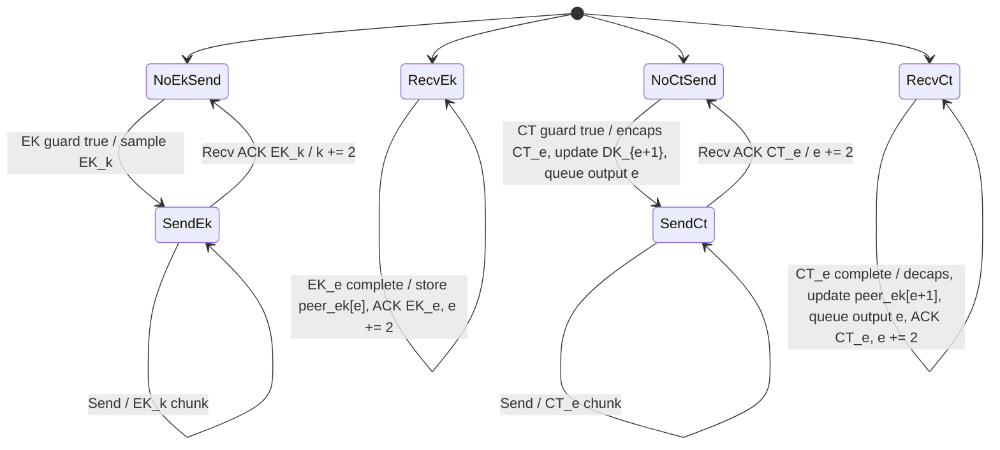

# Opportunistic RKEM Role Model Draft

This is an improved state-machine model for the old Rust
`RkemScka<MockKatana, AGGRESSIVE, FS_RKEM, 32>` simulation.

The Rust code calls this strategy `AGGRESSIVE`, but this is not the same as
Agg-UniKEM's aggressive subepoch protocol. Here "aggressive" means that each
party samples and sends the next RKEM public key as soon as the dependency
guards permit, and send scheduling prefers EK chunks over CT chunks.

The model below keeps the sparse opportunistic behavior but normalizes the
epoch numbering and makes the product-state guards explicit. The goal is a C++
implementation that is easier to audit than the Rust implementation, not a
line-for-line port of the Rust counter machine.

## RKEM Objects

Each epoch `e` has two protocol objects:

* `EK_e`: the receiver public key for output epoch `e`;
* `CT_e`: a ciphertext encapsulated to `EK_e`.

Decapsulating `CT_e` with the matching local `DK_e` emits SCKA output
`message:e`.

Because this is an RKEM, `CT_e` also ratchets the key for the next local output
epoch:

* the CT sender uses local `DK_{e+1}` as the update secret when encapsulating
  to peer `EK_e`;
* after sending `CT_e`, the CT sender stores an updated local `DK_{e+1}`;
* after receiving and decapsulating `CT_e`, the CT receiver stores an updated
  peer `EK_{e+1}`.

The updated `DK_{e+1}` and updated `EK_{e+1}` are the pair used when the other
party later sends `CT_{e+1}`.

## Epoch Parity

Both parties run the same bidirectional machine. Epoch parity determines which
party sends the EK and which party sends the CT.

This draft uses normalized epochs:

* output epochs are `1, 2, 3, ...`;
* Alice sends `CT_e` for odd `e` and `EK_e` for even `e`;
* Bob sends `EK_e` for odd `e` and `CT_e` for even `e`.

Equivalently, each party has:

* local EK epochs: epochs for which it sends `EK_e` and receives `CT_e`;
* peer EK epochs: epochs for which it receives `EK_e` and sends `CT_e`.

The Rust implementation starts with offset epochs and sentinel ACK entries.
Those offsets are bookkeeping, not protocol substance. The C++ model should use
the normalized epoch numbers above.

## Message Format

Every application send carries at most one protocol chunk plus ACK counters.

```text
Message {
    object: None | EK | CT,
    object_epoch: e,
    chunk: optional chunk,
    latest_complete_ek_epoch: optional e,
    latest_complete_ct_epoch: optional e,
    using_epoch: largest output epoch the sender believes both parties can use
}
```

For simulator robustness, ACKs should be monotone complete-object ACKs rather
than raw chunk counters. This is an intentional simplification relative to the
Rust code. Chunk counters are only needed if we want partial-receipt scheduling
strategies; this draft models only the opportunistic/aggressive RKEM strategy.

All roles ignore chunks for old epochs. A chunk for a future epoch may be
accepted only if it is the next expected epoch of that object type; otherwise it
is ignored or treated as a protocol error under a debug policy.

## Local State

Each participant keeps one send-side EK machine and one send-side CT machine.
The role-level state is their product.

Core local variables:

* `next_local_ek`: next epoch for which this party may send an EK;
* `next_local_ct`: next epoch for which this party may send a CT;
* `next_peer_ek`: next peer EK epoch being decoded;
* `next_peer_ct`: next peer CT epoch being decoded;
* map `local_dk[e]` for local EK epochs not yet decapsulated by a peer CT;
* map `peer_ek[e]` for peer EK epochs available for encapsulation;
* active EK encoder for at most one local EK epoch;
* active CT encoder for at most one local CT epoch;
* active EK decoder for at most one peer EK epoch;
* active CT decoder for at most one peer CT epoch;
* monotone complete-object ACKs learned from the peer.

The implementation may store maps or a small window. The protocol only needs a
bounded live window under the guards below.

## Initial State

The setup gives Alice Bob's initial updated `EK_1`, and gives Bob the matching
updated `DK_1`.

Thus:

* Alice has `peer_ek[1]` and can eventually send `CT_1`;
* Bob has `local_dk[1]` and can decapsulate `CT_1`;
* Alice's first local EK epoch is `2`;
* Bob's first local EK epoch is `3`.

This asymmetry is the minimal normalized equivalent of the Rust bootstrap. It
lets output epoch `1` be Bob's local receive epoch and Alice's first CT epoch,
while both parties subsequently alternate parity.

Bootstrap complete-object facts:

* `EK_1` is complete at Alice from setup;
* `EK_1` is considered acknowledged by Alice for scheduling, because Bob does
  not need to receive it over the channel;
* each party's first local EK send ignores the previous-CT guard that would
  otherwise refer to a pre-setup epoch.

## Send Scheduling

On each send, the participant first tries to start any newly enabled EK or CT
object. It then chooses one chunk to transmit.

For the opportunistic/aggressive RKEM strategy:

1. If an EK encoder is active, send the next EK chunk.
2. Otherwise, if a CT encoder is active, send the next CT chunk.
3. Otherwise, send a protocol message with no chunk but with current ACKs.

This reproduces the Rust `AGGRESSIVE` scheduling preference while making the
dependency guards explicit.

## EK Send Guard

The participant may sample and start sending local `EK_k` when all of these are
true:

* there is no active EK encoder;
* peer has acknowledged the previous local EK, `EK_{k-2}`;
* peer has acknowledged the previous local CT this party sent, `CT_{k-1}`.

Bootstrap exceptions:

* if `k` is the party's first local EK epoch, the previous-EK and previous-CT
  guards are satisfied by setup facts.

Transition:

| Event | Transition | Output / notes |
|---|---|---|
| Guard true | `NoEkSend(k)` to `SendEk(k)` | sample `(EK_k, DK_k)`, store `local_dk[k]`, encode `EK_k` |
| Send | stay in `SendEk(k)` | send next EK chunk |
| Peer ACKs `EK_k` | `SendEk(k)` to `NoEkSend(k+2)` | clear active encoder; retain `DK_k` until peer `CT_k` is decoded |

## CT Send Guard

The participant may sample and start sending local `CT_e` when all of these are
true:

* there is no active CT encoder;
* peer `EK_e` is complete locally;
* local `DK_{e+1}` exists;
* peer has acknowledged local `EK_{e+1}`;
* peer `CT_{e-1}` is complete locally.

The `EK_{e+1}` ACK guard is what makes the RKEM update safe: the peer must have
the public key that will be updated by this CT.

Bootstrap exception:

* for `e = 1`, Alice may use setup `peer_ek[1]`; the `CT_0` guard is satisfied
  by setup.

Transition:

| Event | Transition | Output / notes |
|---|---|---|
| Guard true | `NoCtSend(e)` to `SendCt(e)` | encapsulate to `peer_ek[e]`, update and store `local_dk[e+1]`, encode `CT_e`, queue output `message:e` locally |
| Send | stay in `SendCt(e)` | send next CT chunk |
| Peer ACKs `CT_e` | `SendCt(e)` to `NoCtSend(e+2)` | clear active encoder |

The CT sender may compute the shared secret at encapsulation time, but the
messaging layer should expose it only when `using_epoch >= e`, as in the old
`RkemMessagingScka` wrapper.

## EK Receive Machine

The EK receive machine decodes peer EKs for epochs of the opposite parity.

| Event | Transition | Output / notes |
|---|---|---|
| Recv `EK_e` chunk where `e == next_peer_ek` | stay | add chunk to decoder |
| `EK_e` complete | advance to `next_peer_ek += 2` | store `peer_ek[e]` with mode `Nonupdated`; advertise ACK for `EK_e` |
| Recv old `EK` chunk | no-op | stale |
| Recv future `EK` chunk | ignore or debug error | no skipping in this model |

## CT Receive Machine

The CT receive machine decodes peer CTs for epochs of the opposite parity.

| Event | Transition | Output / notes |
|---|---|---|
| Recv `CT_e` chunk where `e == next_peer_ct` | stay | add chunk to decoder |
| `CT_e` complete and prerequisites exist | advance to `next_peer_ct += 2` | decapsulate with `local_dk[e]`, update `peer_ek[e+1]`, emit/queue `message:e`, advertise ACK for `CT_e` |
| `CT_e` complete but prerequisites missing | cache or debug error | should be unreachable under send guards and eventual delivery |
| Recv old `CT` chunk | no-op | stale |
| Recv future `CT` chunk | ignore or debug error | no skipping in this model |

Decapsulation prerequisites:

* `local_dk[e]` exists;
* `peer_ek[e+1]` exists.

After successful decapsulation, `local_dk[e]` is deleted. The updated
`peer_ek[e+1]` replaces the nonupdated peer EK for that epoch.

## Mutual Output / `using_epoch`

The Rust implementation computes a "latest mutual epoch" from CT ACK counters.
For the normalized C++ model:

* a party has locally available output `e` after it sends or receives `CT_e`;
* a party believes output `e` is mutually available once it knows both `CT_e`
  and `CT_{e-1}` are complete at the peer;
* `using_epoch` is the largest contiguous epoch satisfying that condition.

The messaging wrapper should release queued outputs in order up to
`using_epoch`. This preserves sparse CKA behavior without leaking outputs whose
peer availability is not yet known.

## Vulnerability Model

Resident RKEM secrets expose SCKA outputs by epoch.

For FS RKEM:

* a resident nonupdated `DK_e` exposes output `e`;
* a resident updated `DK_e` exposes output `e`;
* once `CT_{e-1}` has updated `DK_e`, compromise of `DK_e` should not expose
  output `e-1`.

For the simulator, represent resident RKEM protocol secrets as
`OppRkemOutputPattern{epoch}`. A compromised pattern for epoch `e` resolves
exactly to SCKA output `message:e`.

Queued but unreleased SCKA outputs are also resident secrets and expose their
own epoch.

## Intended Improvements Over Rust

1. Normalize epochs to output epochs `1, 2, 3, ...`.
2. Replace raw ACK chunk counters with monotone complete-object ACKs for the
   aggressive strategy.
3. Make EK and CT send guards explicit instead of deriving them from sentinel
   ACK table entries.
4. Treat future chunks as invalid unless they are exactly the next expected
   object epoch. This avoids silent epoch skipping.
5. Keep RKEM update semantics explicit: `CT_e` updates `DK_{e+1}` at the sender
   and `EK_{e+1}` at the receiver.

## Liveness Sketch

Claim:

> If both parties start from setup, messages are eventually delivered, and both
> parties continue to send often enough, then both parties emit every output
> epoch in order.

Sketch:

1. Alice's first local EK epoch is `2`, so Alice can eventually send `EK_2`.
2. Bob can receive `EK_2`; after that, setup `DK_1` and Alice's acknowledged
   `EK_2` allow Alice to send `CT_1`.
3. Bob can eventually decode `CT_1`, emit
   `message:1`, and acknowledge `CT_1`.
4. Bob's first local EK epoch is `3`, so Bob can send `EK_3`; Alice can receive
   and acknowledge it, enabling Bob to send `CT_2` once Bob's local
   dependencies are satisfied.
5. Each `CT_e` produces output `e` and installs the updated key material needed
   for epoch `e+1`.
6. The EK send guard ensures the next RKEM public key keeps moving; the CT send
   guard ensures each ciphertext is sent only when both sides can resolve the
   resulting update.
7. Since ACKs are eventually delivered in later messages, active encoders clear
   and the next parity epoch becomes enabled.

## Mermaid Sketch

This diagram shows the two submachines whose product is the participant state.


