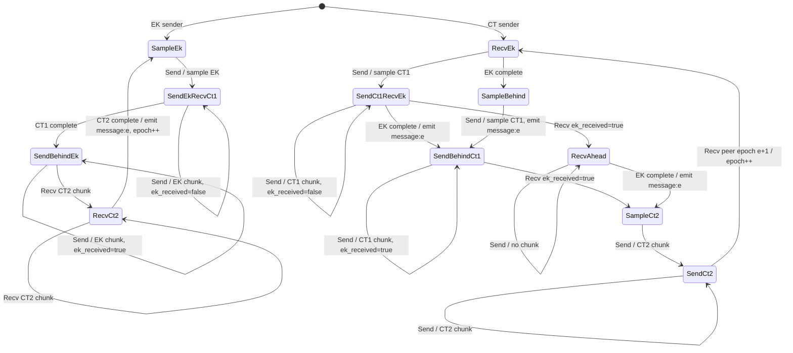

# Opportunistic UniKEM Role Model Draft

This is the simplified simulator model for `opportunistic_unikem/v1`: MACs and
authenticator state are removed, but the chunked state-machine timing is kept.

Epochs are plain message epochs. There are no subepochs and no skipping:
successful epoch `e` emits SCKA output `message:e`, then the receiver advances
to epoch `e + 1` as the CT-sender role. The CT sender keeps sending CT2 until
it sees a peer message for epoch `e + 1`; it then advances to epoch `e + 1` as
the EK-sender role. Thus Alice starts as the EK sender and Bob starts as the CT
sender, but the roles alternate after every epoch.

All roles ignore messages for old epochs. The CT sender keeps sending CT2 for
epoch `e` until it receives an EK-sender message for epoch `e + 1`; that message
proves the EK sender decoded CT2 and advanced.

## EK-Sender Role

The EK sender sends EK chunks, receives CT1 chunks, then receives CT2 chunks.

Local state includes:

* current epoch `e`;
* an EK encoder and DK after EK sampling;
* a CT1 decoder or cached complete CT1;
* a CT2 decoder once CT2 starts.

### `SampleEk`

No EK has been sampled for epoch `e`.

| Event | Transition | Output / notes |
|---|---|---|
| Send | sample `(EK, DK)`, encode EK, go to `SendEkRecvCt1` | send first EK chunk with `ek_received=false` |
| Recv any | no-op | no epoch data can be processed before local EK exists |

### `SendEkRecvCt1`

The EK sender is sending EK and receiving CT1.

| Event | Transition | Output / notes |
|---|---|---|
| Send | stay | send next EK chunk with `ek_received=false` |
| Recv CT1 chunk | add to CT1 decoder; if complete, go to `SendBehindEk` | cache CT1 |
| Recv other | no-op or protocol error | stale/impossible |

### `SendBehindEk`

CT1 is complete, but the peer may not know that this side has received enough
for the next phase. The EK sender continues sending EK chunks with
`ek_received=true`, which acts as an acknowledgement to the CT sender.

| Event | Transition | Output / notes |
|---|---|---|
| Send | stay | send next EK chunk with `ek_received=true` |
| Recv CT2 chunk | go to `RecvCt2` | start CT2 decoder |
| Recv other | no-op | wait for CT2 |

### `RecvCt2`

The EK sender has CT1 and is receiving CT2.

| Event | Transition | Output / notes |
|---|---|---|
| Send | stay | no chunk; keep sending `ek_received=true` |
| Recv CT2 chunk | add to CT2 decoder; if complete, go to `SampleEk(e+1)` | decapsulate, emit `message:e` |

## CT-Sender Role

The CT sender sends CT1 opportunistically before it has received EK. Once EK is
available it can emit the epoch key, then sends CT2.

Local state includes:

* current epoch `e`;
* an EK decoder until EK completes;
* CT1 encapsulation state `ES` and encoder after CT1 sampling;
* a cached EK after EK completion;
* a CT2 encoder once CT2 has been sampled.

### `RecvEk`

The CT sender has not yet sampled CT1 and is receiving EK.

| Event | Transition | Output / notes |
|---|---|---|
| Send | sample `(CT1, ES)`, encode CT1, go to `SendCt1RecvEk` | send first CT1 chunk with `ek_received=false` |
| Recv EK chunk | add to EK decoder; if complete, go to `SampleBehind` | cache EK |

### `SendCt1RecvEk`

The CT sender is sending CT1 and receiving EK.

| Event | Transition | Output / notes |
|---|---|---|
| Send | stay | send next CT1 chunk with `ek_received=false` |
| Recv EK chunk | add to EK decoder; if complete, go to `SendBehindCt1` | emit `message:e`; continue sending CT1 |
| Recv `ek_received=true` | go to `RecvAhead` | peer has CT1; stop sending CT1 and wait for EK |

### `SampleBehind`

EK completed before CT1 was sampled.

| Event | Transition | Output / notes |
|---|---|---|
| Send | sample `(CT1, ES)`, commit with cached EK, go to `SendBehindCt1` | emit `message:e`; send CT1 with `ek_received=true` |
| Recv any | no-op | already have EK |

### `SendBehindCt1`

The CT sender has emitted the key but is still sending CT1 until it sees the EK
sender acknowledge CT1.

| Event | Transition | Output / notes |
|---|---|---|
| Send | stay | send next CT1 chunk with `ek_received=true` |
| Recv `ek_received=true` | go to `SampleCt2` | peer has CT1 |
| Recv other | no-op | keep sending CT1 |

### `RecvAhead`

The EK sender has acknowledged CT1 before the CT sender has completed EK.

| Event | Transition | Output / notes |
|---|---|---|
| Send | stay | no chunk; send `ek_received=false` |
| Recv EK chunk | add to EK decoder; if complete, go to `SampleCt2` | emit `message:e` |

### `SampleCt2`

The CT sender has both `ES` and EK and is ready to send CT2.

| Event | Transition | Output / notes |
|---|---|---|
| Send | sample/encode CT2, go to `SendCt2` | send first CT2 chunk with `ek_received=true` |
| Recv any | no-op | commitment is fixed |

### `SendCt2`

The CT sender sends CT2 for epoch `e`.

| Event | Transition | Output / notes |
|---|---|---|
| Send | stay | send next CT2 chunk with `ek_received=true` |
| Recv peer message for epoch `e+1` | go to `RecvEk(e+1)` | peer decoded CT2 and advanced |
| Recv old/current epoch | no-op | keep sending CT2 |

## Resolver

Resident protocol secrets are represented as `OppUniKemOutputPattern{epoch}`.
The resolver is exact: if epoch `e` was emitted and a compromised pattern names
`e`, then the compromised SCKA output is `message:e`.

## Mermaid Role Diagram

